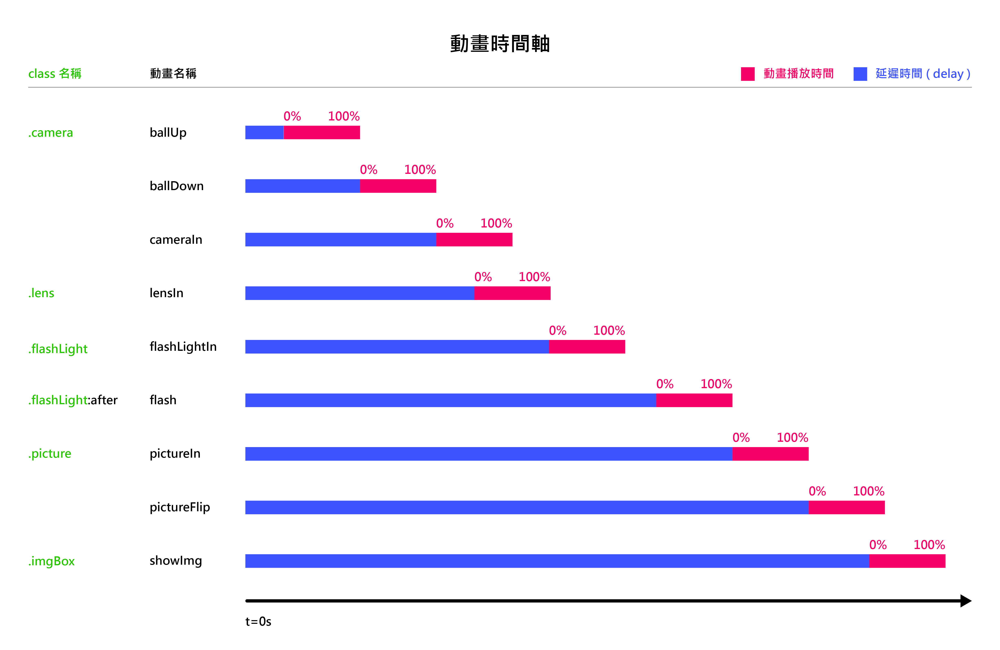

# 練習 css 的 animation - instagram
在練習的同時 
加入最近學的 sass 
因為工作完全沒用到 sass (工作佔據我大部分的時間啊啊啊啊) 
所以也沒有機會可以練習 
 
至於動畫... 
其實我並沒學過動畫 
所以在設計動畫時間完全是參考下圖 
 
只能說好羨慕會設計動畫的人啊！！！ 
 
動畫做完之後.. 
想說順便把一些和使用者互動的功能做一做好了 
所以裡面有一些可以按讚和留言可以玩喔！！ 